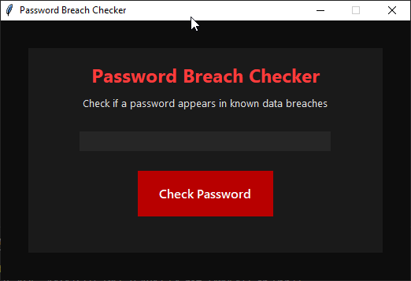
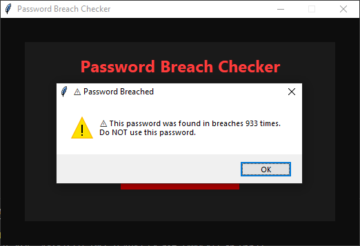
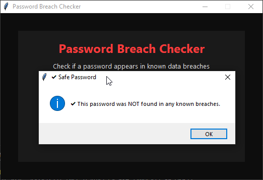

# Password Breach Checker  
A modern red/black themed desktop application that checks if a password appears in known data breaches using the HaveIBeenPwned API (k-Anonymity method).



---

## Features
- ✔ Modern dark UI with red accent theme  
- ✔ Uses the official HaveIBeenPwned range API (privacy-safe)  
- ✔ Password masked input  
- ✔ Checks breaches using SHA-1 hash prefix search  
- ✔ Enter key support (no need to click)  
- ✔ Standalone EXE available via PyInstaller  
- ✔ Zero external GUI dependencies (Tkinter only)

---

## How It Works
1. Your password is **never sent** to the API.  
2. The app:
   - Hashes the password using SHA-1  
   - Sends only the **first 5 characters** of the hash  
   - Compares locally with all hash suffixes returned  
3. If a match is found → password has appeared in breaches  
4. Otherwise → password is not found in known breach databases  

This preserves user privacy while still giving an accurate breach check.

---

## Installation

### **Run from source**
```bash
pip install -r requirements.txt
python main.py
```

### **Build your own .exe (Windows)**
```bash
pyinstaller --onefile --windowed main.py
```

This creates:
```
dist/main.exe
```

---

## Screenshots

### Main Window  


### Breached Password Example  


### Safe Password Example  


---

## Technologies Used
- Python 3.x  
- Tkinter (GUI)  
- Requests  
- HaveIBeenPwned API  
- SHA-1 hashing  

---

## License
MIT License

---

## Future Improvements
- [ ] Password strength rating  
- [ ] Animated “scan” effect  
- [ ] System tray version  
- [ ] Auto-update mechanism  
- [ ] Glassmorphism UI  

---

## Contributing
Pull requests are welcome! For major changes, please open an issue first.

---

## Author
Built by **Rich Connell**

